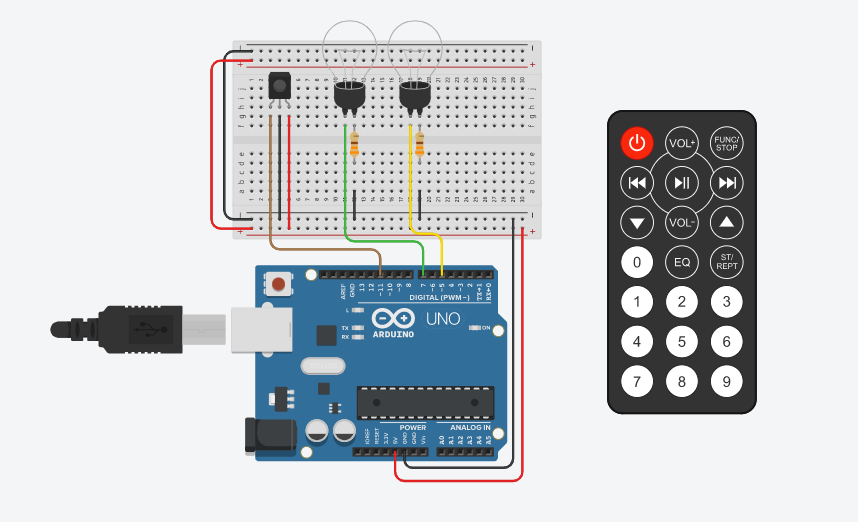

# lampada-controle-arduino

### Link do Projeto:

https://www.tinkercad.com/things/aSvq77bK2u2-lampadas-controle-remoto/editel?sharecode=2A5kdZ_BcGd1GdoWW_WoBFWRl-6M0UhdNdiddmBzqt4

## Materiais Usados:

- Arduino Uno R3
- Placa de ensaio pequena
- Sensor de infravermelho
- 2 Lâmpadas
- 2 Resistores de 330Ω
- Controle remoto

